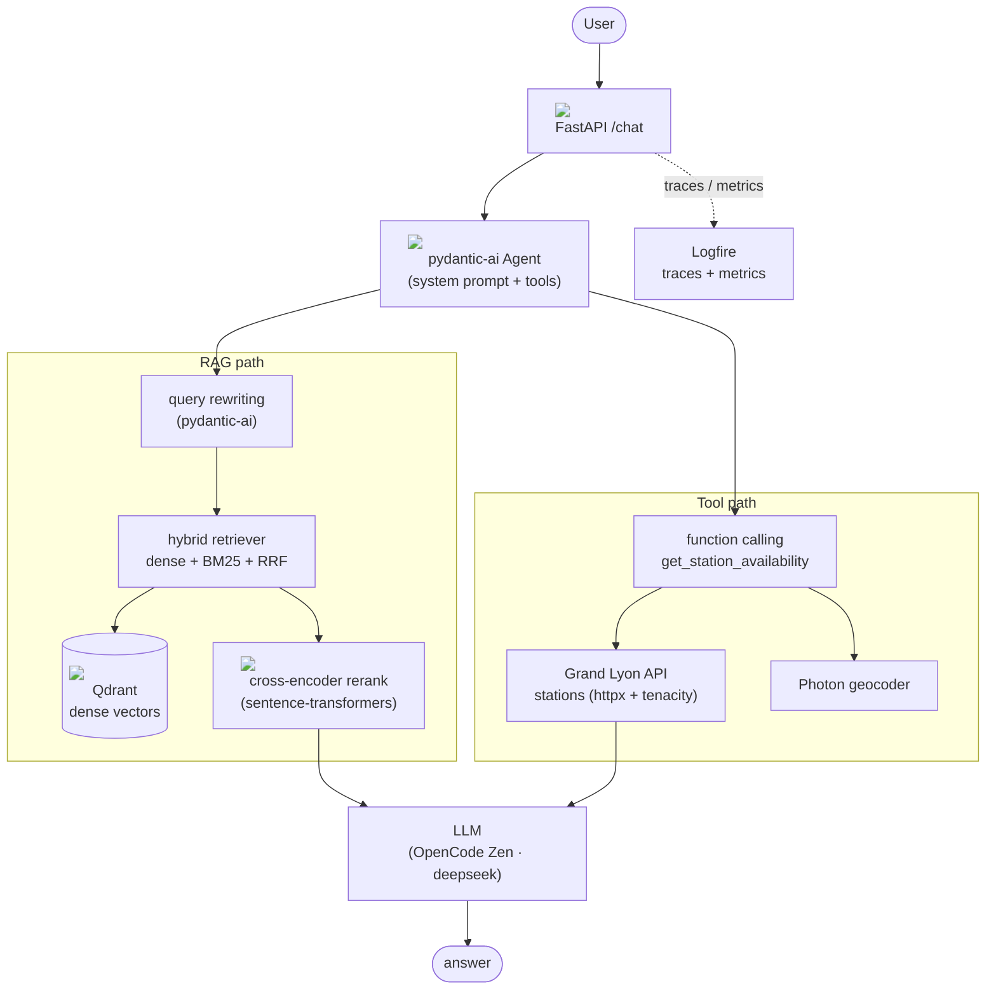
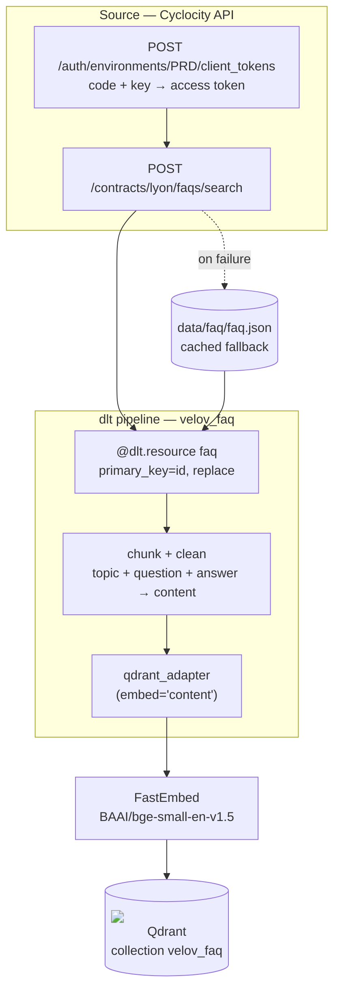

# velov-assistant

An AI assistant for Lyon's self-service bike network (Vélo'v) with:

- **RAG** — answers about policies, pricing and rules from the official FAQ.
- **Function calling** — real-time station availability and nearest-bike lookups.

## Problem description

Tourists and newcomers in Lyon need quick information about how Vélo'v works. That
information lives in the FAQ on the Vélo'v website, which is tedious to browse. The
assistant answers FAQ questions and checks real-time bike availability, e.g.:

- "Which is the nearest station with bikes available near Part-Dieu?"
- "Can I book several bikes with one card?"

## Project layout

The repo root is the single project home — the dlthub workspace and the Velo'v
application live side by side. Run all commands from the repo root.

## Architecture

See [`docs/architecture.md`](docs/architecture.md) for the full mermaid diagram,
directory structure and module-by-module plan.

### Agent (runtime)



### Ingestion (dlt)



> Tech logos come from [Simple Icons](https://simpleicons.org); they may not render in
> every markdown viewer, but the text labels stay readable.

## Quick start (Docker)

```bash
cp .env.example .env          # fill in OPENAI_API_KEY (OpenCode Zen) + LLM_MODEL + LOGFIRE_TOKEN
docker compose up --build
```

Services: Qdrant (`:6333`), app (`:8000`).

Then try:

```bash
curl -s localhost:8000/chat -H 'content-type: application/json' \
  -d '{"message":"Is there a bike near Part-Dieu right now?"}'
```

## Local development

```bash
uv sync                                       # install deps
uv run ingest                                 # dlt: fetch FAQ -> chunk -> embed -> Qdrant
uv run uvicorn app.main:app --host 0.0.0.0 --port 8000 --reload
uv run demo                                   # sample queries against the app
```

Other commands: `uv run eval`, `uv run eval-gen`, `uv run eval-retrieval`, `uv run eval-llm`.
Lint/format: `uv run ruff check .` and `uv run ruff format .`.

## Ingestion (dlt)

- `ingestion/faq_pipeline.py` — fetches the FAQ from the Cyclocity API (anonymous
  client-token exchange), chunks it and loads it into Qdrant with dense embeddings via
  `qdrant_adapter(resource, embed="content")` (FastEmbed model). Falls back to
  `data/faq/faq.json` if the live fetch fails.

Qdrant destination config lives in `.dlt/config.toml`; override with
`DESTINATION__QDRANT__QD_LOCATION` / `DESTINATION__QDRANT__MODEL`.

## Retrieval & RAG

- **Query rewriting** (`app/rag/llm.py`) — a pydantic-ai agent expands the query.
- **Hybrid search** (`app/rag/retriever.py`) — dense (FastEmbed, Qdrant) + sparse
  (BM25) fused with RRF; three modes evaluable separately.
- **Re-ranking** — cross-encoder re-scores the fused top-K.

## Evaluation

```bash
uv run eval-gen         # generate ground-truth questions from the FAQ
uv run eval-retrieval   # hit rate / MRR (dense vs sparse vs hybrid)
uv run eval-llm         # LLM-as-judge
uv run eval             # run retrieval + LLM evals together
```

## Monitoring (Logfire)

Tracing and metrics are sent to **Pydantic Logfire** (set `LOGFIRE_TOKEN`). The app
emits spans for the chat handler, retriever, reranker and tool calls, plus metrics:
requests, retrieval/LLM/total latency, token usage, error count and feedback (+1/-1).
Charts for the 5 required panels (queries over time, latency breakdown, feedback
distribution, vector-vs-tool ratio, error rate + tokens) are built in the Logfire UI.

## Reproducibility

All dependency versions are pinned in `pyproject.toml` (locked via `uv.lock`).
