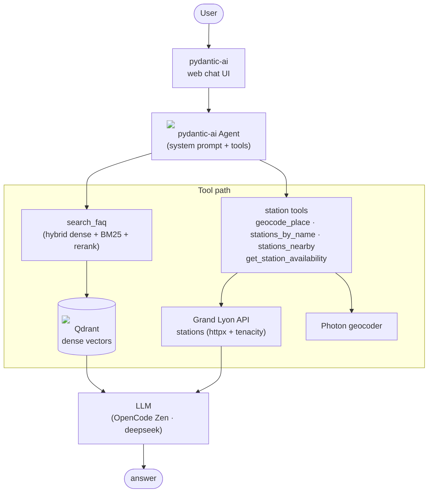
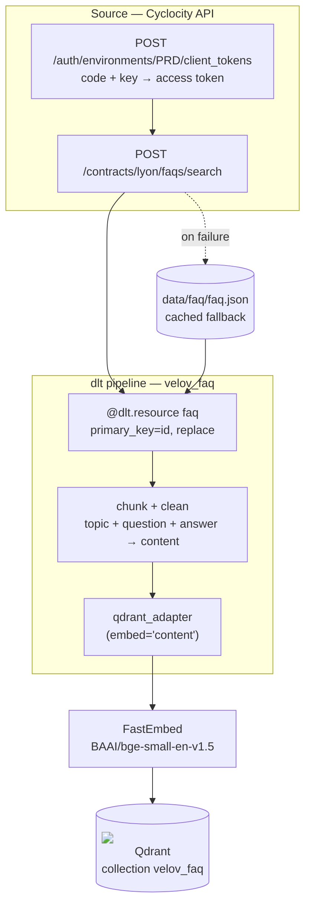

# velov-assistant

An AI assistant for Lyon's self-service bike network (Vélo'v) with:

- **RAG** — answers about policies, pricing and rules from the official FAQ.
- **Function calling** — real-time station availability and nearest-bike lookups.

> 📋 **For reviewers** — the scoring grid is at the bottom of this file: [Evaluation grid](#evaluation-grid).

## Problem description

Tourists and newcomers in Lyon need quick information about how Vélo'v works. That
information lives in the FAQ on the Vélo'v website, which is tedious to browse. The
assistant answers FAQ questions and checks real-time bike availability, e.g.:

- "Which is the nearest station with bikes available near Part-Dieu?"
- "Can I book several bikes with one account?"

## Project layout

The repo root is the single project home — the dlthub workspace and the Velo'v
application live side by side. Run all commands from the repo root.

## Architecture

See [`docs/architecture.md`](docs/architecture.md) for the full mermaid diagram,
directory structure and module-by-module plan.

### Agent (runtime)



### Ingestion (dlt)




## Quick start (Docker)

```bash
cp .env.example .env          # fill in OPENAI_API_KEY (OpenCode Zen) + LLM_MODEL
docker compose up --build
```

Services: 
- qdrant (`:6333`) (knowledge db)
- app (`:8000`). Open http://localhost:8000 for the web chat UI.


## Local development

```bash
uv sync                                       # install deps
uv run ingest                                 # dlt: fetch FAQ -> chunk -> embed -> Qdrant
uv run chat                                   # local: web chat UI + local Qdrant (APP_ENV=local)
```

Two serving modes (selected via `APP_ENV`):

- **`local`** (default) — `agent.to_web()` web chat UI, Qdrant local (`http://localhost:6333`), config `.env`.
- **`dev`** — FastAPI endpoint streaming UI events (Vercel AI Data Stream protocol), Qdrant distant, config `.env.dev`:

```bash
APP_ENV=dev uv run chat   # POST /chat (SSE) + GET /health on :8000
```

Other commands: `uv run eval`, `uv run eval-gen`, `uv run eval-retrieval`, `uv run eval-llm`.
Lint/format: `uv run ruff check .` and `uv run ruff format .`.
Typing: `uv run ty check`
Pre-commit (optional only if you want to dev on this project): `prek install --config .pre-commit.yaml`

## Ingestion (dlt)

- `ingestion/faq_pipeline.py` — fetches the FAQ from the Cyclocity API (anonymous
  client-token exchange), chunks it and loads it into Qdrant with dense embeddings via
  `qdrant_adapter(resource, embed="content")` (FastEmbed model). Falls back to
  `data/faq/faq.json` if the live fetch fails.
- The FAQ source is browsable at <https://velov.grandlyon.com/en/tutorial/groups?tab=FAQ>.

Qdrant destination config lives in `.dlt/config.toml`; override with
`DESTINATION__QDRANT__QD_LOCATION` / `DESTINATION__QDRANT__MODEL`.


## Retrieval & RAG

- **FAQ search tool** (`app/main.py::search_faq`) — the agent calls it to answer policy/pricing/rules questions.
- **Hybrid search** (`app/rag/retriever.py`) — dense (FastEmbed, Qdrant) + sparse
  (BM25) fused with RRF; three modes evaluable separately.
- **Re-ranking** — cross-encoder re-scores the fused top-K.

## Evaluation

```bash
uv run eval-gen         # generate ground-truth questions from the FAQ
uv run eval-retrieval   # hit rate / MRR (dense vs sparse vs hybrid)
uv run eval-llm         # LLM-as-judge
uv run eval             # run retrieval + LLM evals together
```

NB: Executed by CI/CD e.g https://github.com/afrancois-dev/velov-assistant/actions/runs/32058331982

---

## Tests (on local env with pydantic web chat)

### rag


### function_call


## Monitoring dashboards (pydantic logfire)


## Evaluation grid

Evidence and pointers for the reviewer (no score assigned — arguments per criterion):

| Criterion | Where to look / arguments |
|---|---|
| Problem description | `README.md` "Problem description" + `architecture.md` First paragraph : (Vélo'v FAQ + real-time availability for tourists/newcomers) with example questions. |
| Retrieval flow | Knowledge base (Qdrant, `app/rag/retriever.py`) + LLM (pydantic-ai agent, `app/main.py::agent`). The `search_faq` tool does the retrieval; the LLM composes the answer. |
| Retrieval evaluation | `evaluation/retrieval_eval.py` (`uv run eval-retrieval`) — compares dense / sparse / hybrid with hit rate @5 and MRR @5 on `data/faq/ground_truth.json`; the hybrid approach is used in production. |
| LLM evaluation | `evaluation/llm_eval.py` (`uv run eval-llm`) — LLM-as-a-judge scores the generated answer against the ground-truth FAQ answer (`good`/`bad`). |
| Interface | Web chat UI via `agent.to_web()` (`uv run chat`) **and** a FastAPI streaming API (`POST /chat` in the Vercel AI Data Stream protocol + `GET /health`, `APP_ENV=dev uv run chat`). |
| Ingestion pipeline | `ingestion/faq_pipeline.py` — dlt pipeline (`qdrant_adapter(embed="content")`, `write_disposition="replace"`), anonymous client-token auth, cached fallback `data/faq/faq.json`. FAQ source: <https://velov.grandlyon.com/en/tutorial/groups?tab=FAQ>. |
| Monitoring | Logfire tracing — `logfire.configure` in `app/main.py` + pydantic-ai OpenTelemetry instrumentation (spans, token usage, latency). No user-feedback collection. |
| Containerization | Full `docker-compose.yml` (Qdrant + ingestion + app) plus a `Dockerfile`. |
| Reproducibility | `README.md` run instructions; pinned deps in `pyproject.toml` + `uv.lock`; data via dlt ingestion (live) with cached `data/faq/faq.json` fallback. |
| Best practices — hybrid search | `app/rag/retriever.py::hybrid` — dense (FastEmbed) + sparse (BM25) fused with RRF; evaluated in `eval-retrieval`. |
| Best practices — re-ranking | `app/rag/retriever.py::Reranker` — cross-encoder re-ranking (sentence-transformers). |
| Best practices — query rewriting | `app/rag/llm.py::rewrite_query` — rewrite sub-agent invoked by `app/main.py::search_faq` when the first retrieval is weak. |
| Bonus — cloud deployment | Qdrant Cloud (managed vector DB) as the vector store (`QDRANT_URL` in `.env.dev`). A cloud deployment, though not a classic IaaS (GCP/AWS). |
| Bonus — extra | Real-time function calling with external APIs — `app/tools/stations.py` (`geocode_place`, `stations_by_name`, `stations_nearby`, `get_station_availability`) backed by the Grand Lyon API + Photon geocoder (`app/tools/grandlyon.py`). Debug map: <https://velov.grandlyon.com/fr/mapping>. |
