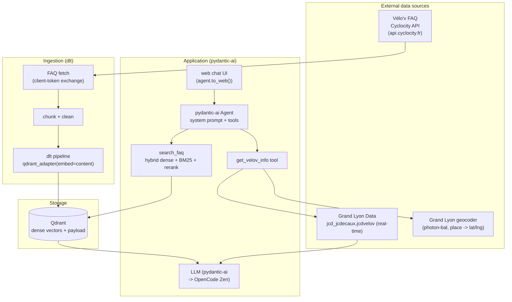

# Vélo'v Assistant — System Architecture

End-to-end LLM-powered assistant for the Lyon Vélo'v bike-sharing network:

1. **RAG** — answers policy / pricing / rules questions from the official FAQ.
2. **Function calling** — one `get_velov_info` facade for real-time station availability & nearby lookups.

---

## 1. System Architecture



## 2. Component workflow

### 2.1 Ingestion (`dlt` → Qdrant)
1. **Fetch** the FAQ from the Cyclocity API (the same backend the velov.grandlyon.com
   SPA calls): a public client `code`/`key` pair is posted to
   `/auth/environments/PRD/client_tokens` to obtain a short-lived access token, which
   then authorizes `/contracts/lyon/faqs/search`. Falls back to the cached
   `data/faq/faq.json` for reproducibility if the live fetch fails.
2. **Chunk** each Q/A into self-contained `content` strings (topic + question + answer).
3. **Embed & load** with dlt's Qdrant destination:
   - `qdrant_adapter(resource, embed="content")` marks the field to vectorize;
   - the destination generates **dense** embeddings via FastEmbed (`model` config).

### 2.2 Query path (RAG as a tool)
1. The agent decides, based on the question, whether to call `search_faq` (policy/pricing/rules)
   or `get_velov_info` (real-time availability).
2. `search_faq` runs hybrid retrieval (three modes, evaluable):
   - `dense` — vector search on the dlt-embedded dense vectors (Qdrant);
   - `sparse` — BM25 over the in-memory FAQ corpus;
   - `hybrid` — reciprocal-rank fusion (RRF) of dense + sparse.
3. **Re-ranking** — a cross-encoder scores the fused top-K and reorders.
4. **Generation** — tool results are returned to the LLM to compose a natural-language answer.

### 2.3 Tool path (real-time, no station DB)
1. The LLM calls the single `get_velov_info` facade; **the LLM never produces raw coordinates**.
2. The facade first checks station names, then geocodes a place with the **Grand Lyon Photon-based** geocoder
   (`download.data.grandlyon.com/geocoding/photon-bal/api`) and fetch the real-time
   `jcd_jcdecaux.jcdvelov` snapshot (name, `lat`/`lng`, `available_bikes`,
   `available_bike_stands`, `status`, `last_update`) — no stations stored locally.
3. Results are returned to the LLM to compose a natural-language answer.

### 2.4 Serving
- `app/main.py` builds the agent and exposes it via `agent.to_web()` — a Starlette app
  served by uvicorn (`uv run chat`).

---

## 3. Directory structure

```
.                              # repo root = single project home (dlthub workspace + app)
├── pyproject.toml             # app + dlthub dependencies (pinned) + [project.scripts]
├── uv.lock
├── .dlt/                      # dlt config (config.toml / secrets.toml)
├── docker-compose.yml         # qdrant + app + ingestion
├── Dockerfile                 # app image
├── .dockerignore
├── .env.example               # template for secrets/config
├── docs/
│   └── architecture.md        # this document
├── ingestion/                 # dlt pipelines
│   └── faq_pipeline.py        # FAQ (Cyclocity API) -> chunk -> embed -> Qdrant
├── app/                       # pydantic-ai service
│   ├── main.py                # agent + tools + agent.to_web() (web chat UI)
│   ├── config.py              # pydantic-settings
│   ├── rag/
│   │   ├── retriever.py       # dense/sparse/hybrid + rerank
│   │   └── llm.py             # pydantic-ai model (OpenCode Zen)
│   └── tools/
│       ├── grandlyon.py       # Grand Lyon datapusher HTTP client + Photon geocoder (cached)
│       └── stations.py        # tool functions (geocode/by-name/nearby/facade)
├── evaluation/
│   ├── data_gen.py            # ground-truth generation (eval-gen)
│   ├── retrieval_eval.py      # hit rate / MRR (dense vs sparse vs hybrid)
│   ├── llm_eval.py            # LLM-as-a-judge
│   └── data/ground_truth.json # (legacy) sample eval set
└── data/faq/
    ├── faq.json               # cached FAQ (reproducible fallback)
    └── ground_truth.json      # sample eval set
```

---

## 4. Implementation plan (module-by-module)

### 4.1 `ingestion/faq_pipeline.py`
- Fetches the FAQ from the Cyclocity API (client-token exchange) with
  `data/faq/faq.json` fallback.
- `@dlt.resource` yields FAQ chunks (`{id, topic, question, answer, content}`).
- `qdrant_adapter(resource, embed="content")` → dense embedding by FastEmbed.
- `dlt.pipeline("velov_faq", destination="qdrant", dataset_name="velov")` → collection `velov_faq`.

### 4.2 `app/rag/retriever.py`
- `search_dense(query)` — Qdrant vector search (dlt-embedded vectors).
- `search_sparse(query)` — in-memory BM25 over the FAQ corpus.
- `hybrid(query)` — RRF fusion of dense + sparse; `Reranker` cross-encoder on top.
- `retrieve(query, mode="hybrid")` returns top-k with scores + payload.

### 4.3 `app/rag/llm.py`
- `get_model()` — `OpenAIChatModel` over `OpenAIProvider`. Two OpenCode endpoints are
  supported, selected via `OPENAI_BASE_URL`:
  - **Zen (free, default)** — `https://opencode.ai/zen/v1/` with `deepseek-v4-flash-free`.
  - **Go (subscription)** — `https://opencode.ai/zen/go/v1/` with a Go model (e.g. `kimi-k3`).

### 4.4 `app/tools/stations.py`
- One `get_velov_info(location, radius_m, limit, need_bikes, need_free_stands, sort_by)` tool.
- It performs station matching or Photon geocoding, radius/filter/sort rules, and returns real-time availability.
- Station snapshots remain cached for 30 seconds.
- `grandlyon.py` fetches `jcd_jcdecaux.jcdvelov/all.json?maxfeatures=-1` (cached) and
  geocodes via `download.data.grandlyon.com/geocoding/photon-bal/api`.

### 4.5 `evaluation/`
- `data_gen.py` — LLM-generated ground-truth questions (`uv run eval-gen`).
- `retrieval_eval.py` — hit rate & MRR over `data/faq/ground_truth.json` for all 3 modes.
- `llm_eval.py` — LLM-as-a-judge scoring.

---

## 5. Reproducibility

- All package versions pinned in `pyproject.toml` (via `uv.lock`).
- One-command start: `docker compose up --build`.
- Commands via `uv run <script>` (see `[project.scripts]` in `pyproject.toml`).
