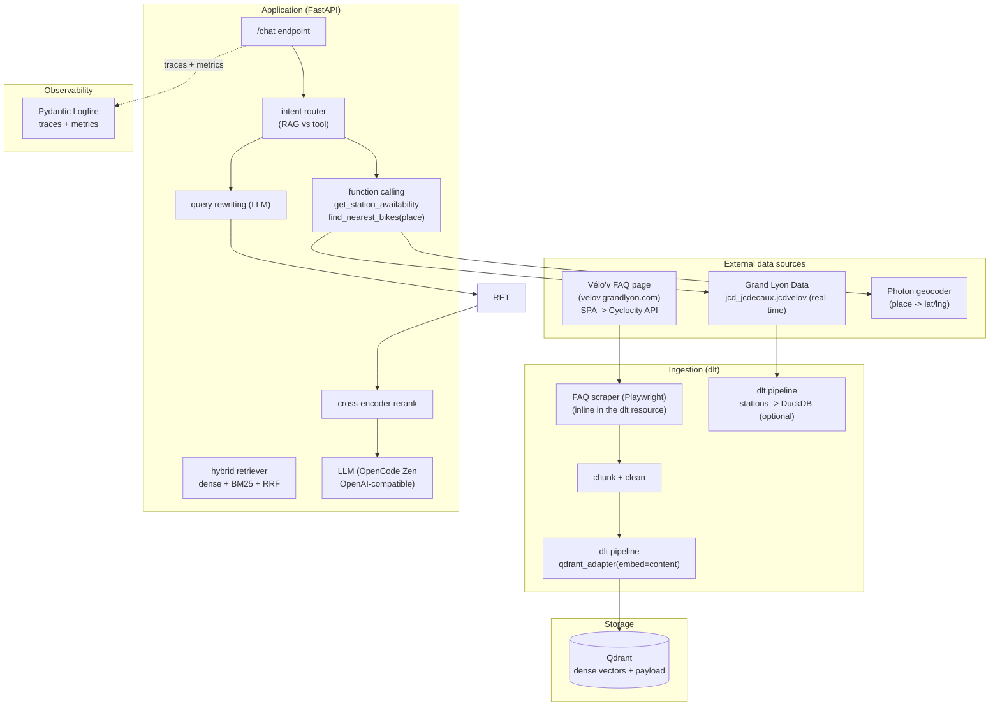

# Vélo'v Assistant — System Architecture

End-to-end LLM-powered assistant for the Lyon Vélo'v bike-sharing network:

1. **RAG** — answers policy / pricing / rules questions from the official FAQ.
2. **Function calling** — real-time station availability & nearest-bike lookups.

---

## 1. System Architecture



## 2. Component workflow

### 2.1 Ingestion (`dlt` → Qdrant)
1. **Scrape** the FAQ inline in the dlt resource (Playwright renders the SPA); falls back
   to the cached `data/faq/faq.json` for reproducibility if the live scrape fails.
2. **Chunk** each Q/A into self-contained `content` strings (topic + question + answer).
3. **Embed & load** with dlt's Qdrant destination:
   - `qdrant_adapter(resource, embed="content")` marks the field to vectorize;
   - the destination generates **dense** embeddings via FastEmbed (`model` config).

### 2.2 Query path (RAG)
1. **Query rewriting** — the LLM expands the raw user question into 1–3 retrieval variants.
2. **Retrieval** (three modes, evaluable):
   - `dense` — vector search on the dlt-embedded dense vectors (Qdrant);
   - `sparse` — BM25 over the in-memory FAQ corpus;
   - `hybrid` — reciprocal-rank fusion (RRF) of dense + sparse.
3. **Re-ranking** — a cross-encoder scores the fused top-K and reorders.
4. **Generation** — top documents are injected into the prompt and answered by the LLM.

### 2.3 Tool path (real-time, no station DB)
1. The LLM calls `get_station_availability(name_or_location)` or
   `find_nearest_bikes(place)`; **the LLM never produces raw coordinates**.
2. Tools geocode the place with the **Photon** geocoder and fetch the real-time
   `jcd_jcdecaux.jcdvelov` snapshot (name, `lat`/`lng`, `available_bikes`,
   `available_bike_stands`, `status`, `last_update`) — no stations stored locally.
3. Results are returned to the LLM to compose a natural-language answer.

### 2.4 Observability
- **Logfire** instruments the chat handler, retriever, reranker and tool calls with spans.
- The app emits **metrics** (requests, latency, tokens, errors, feedback) directly to
  Logfire; charts are built in the Logfire UI.

---

## 3. Directory structure

```
.                              # repo root = single project home (dlthub workspace + app)
├── pyproject.toml             # app + dlthub dependencies (pinned) + [project.scripts]
├── uv.lock
├── .dlt/                      # dlt config (config.toml / secrets.toml)
├── docker-compose.yml         # qdrant + app + ingestion
├── Dockerfile                 # app image
├── .dockerignore
├── .env.example               # template for secrets/config
├── docs/
│   └── architecture.md        # this document
├── ingestion/                 # dlt pipelines
│   ├── faq_pipeline.py        # FAQ -> chunk -> embed -> Qdrant
│   └── stations_pipeline.py   # stations -> DuckDB (optional snapshot)
├── app/                       # FastAPI service
│   ├── main.py                # /chat, /feedback endpoints
│   ├── config.py              # pydantic-settings
│   ├── schemas.py             # request/response models
│   ├── rag/
│   │   ├── retriever.py       # dense/sparse/hybrid + rerank
│   │   └── llm.py             # OpenCode client + query rewriting
│   ├── tools/
│   │   ├── grandlyon.py       # Grand Lyon datapusher HTTP client + Photon geocoder
│   │   └── stations.py        # function schemas + impl
│   └── monitoring/
│       ├── logfire_setup.py   # tracing config
│       └── metrics.py         # Logfire metrics
├── evaluation/
│   ├── retrieval_eval.py      # hit rate / MRR (dense vs sparse vs hybrid)
│   ├── llm_eval.py            # LLM-as-a-judge
│   └── data/ground_truth.json # sample eval set
├── scripts/
│   └── sample_query.py        # end-to-end demo
└── data/faq/faq.json          # cached FAQ (reproducible fallback)
```

---

## 4. Implementation plan (module-by-module)

### 4.1 `ingestion/faq_pipeline.py`
- Scrapes the FAQ (Playwright, inline in the resource) with `data/faq/faq.json` fallback.
- `@dlt.resource` yields FAQ chunks (`{id, topic, question, answer, content}`).
- `qdrant_adapter(resource, embed="content")` → dense embedding by FastEmbed.
- `dlt.pipeline("velov_faq", destination="qdrant", dataset_name="velov")` → collection `velov_faq`.

### 4.2 `app/rag/retriever.py`
- `search_dense(query)` — Qdrant vector search (dlt-embedded vectors).
- `search_sparse(query)` — in-memory BM25 over the FAQ corpus.
- `hybrid(query)` — RRF fusion of dense + sparse; `Reranker` cross-encoder on top.
- `retrieve(query, mode="hybrid")` returns top-k with scores + payload.

### 4.3 `app/rag/llm.py`
- OpenCode Zen endpoint (`https://opencode.ai/zen/v1/`) via `openai.OpenAI`.
- `rewrite_query(q)` → 1–3 variants; retrieve per variant, merge, dedupe.

### 4.4 `app/tools/stations.py`
- Tool schemas for `get_station_availability(name_or_location)` and
  `find_nearest_bikes(place)` (place geocoded via Photon, no raw coords from the LLM).
- `grandlyon.py` fetches `jcd_jcdecaux.jcdvelov/all.json?maxfeatures=-1` and geocodes.

### 4.5 `app/monitoring/`
- `logfire_setup.py` — `logfire.configure()` (token optional).
- `metrics.py` — Logfire counters/histograms: requests, latency, tokens, errors, feedback.

### 4.6 `evaluation/`
- `retrieval_eval.py` — hit rate & MRR over `ground_truth.json` for all 3 modes.
- `llm_eval.py` — LLM-as-a-judge scoring.

---

## 5. Monitoring (Logfire, ≥ 5 charts)

| # | Panel | Logfire metric |
|---|-------|----------------|
| 1 | Total queries & requests over time | `velov.requests` |
| 2 | Latency breakdown (retrieval vs LLM) | `velov.latency.retrieval_ms` / `velov.latency.llm_ms` |
| 3 | User feedback distribution (up/down) | `velov.feedback{rating=up\|down}` |
| 4 | Vector search vs function calling ratio | `velov.requests{intent=rag\|tool}` |
| 5 | Error rate & token consumption | `velov.errors`, `velov.tokens` |

---

## 6. Reproducibility

- All package versions pinned in `pyproject.toml` (via `uv.lock`).
- One-command start: `docker compose up --build`.
- Commands via `uv run <script>` (see `[project.scripts]` in `pyproject.toml`).
