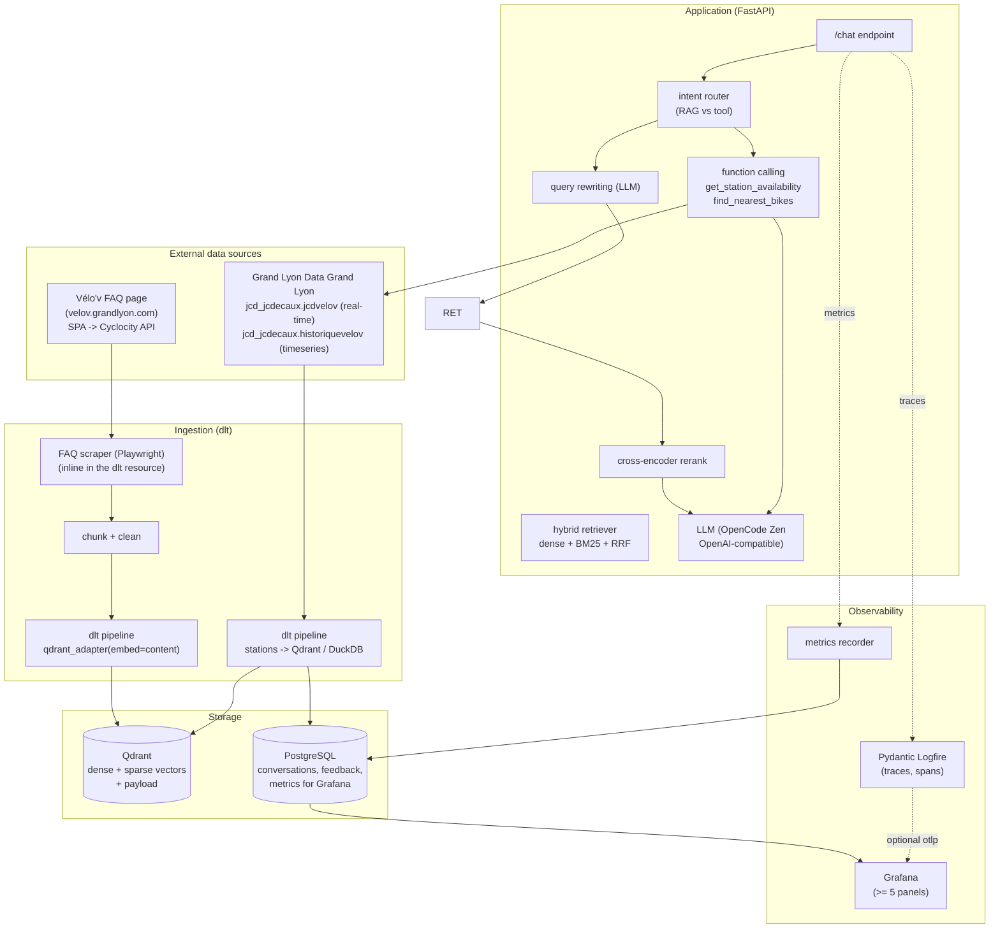

# Vélo'v Assistant — System Architecture

End-to-end LLM-powered assistant for the Lyon Vélo'v bike-sharing network:

1. **RAG** — answers policy / pricing / rules questions from the official FAQ.
2. **Function calling** — real-time station availability & nearest-bike lookups.

---

## 1. System Architecture



## 2. Component workflow

### 2.1 Ingestion (`dlt` → Qdrant)
1. **Scrape** the FAQ inline in the dlt resource (Playwright renders the SPA); falls back
   to the curated `data/faq/faq.json` for reproducibility if the live scrape fails.
2. **Chunk** each Q/A into self-contained `content` strings (title + question + answer).
3. **Embed & load** with dlt's Qdrant destination:
   - `qdrant_adapter(resource, embed="content")` marks the field to vectorize;
   - the destination generates **dense** embeddings via FastEmbed (`model` config).
4. The retriever adds a **full-text (BM25) index** on `content` at startup for **sparse** search.

### 2.2 Query path (RAG)
1. **Query rewriting** — the LLM expands the raw user question into 1–3 retrieval variants.
2. **Retrieval** (three modes, evaluable):
   - `dense` — vector search on the dlt-embedded dense vectors;
   - `sparse` — BM25 full-text search on the payload;
   - `hybrid` — reciprocal-rank fusion (RRF) of dense + sparse.
3. **Re-ranking** — a cross-encoder scores the fused top-K and reorders.
4. **Generation** — top documents are injected into the prompt and answered by the LLM.

### 2.3 Tool path (real-time)
1. The LLM decides to call `get_station_availability(name_or_location)` or
   `find_nearest_bikes(latitude, longitude)` based on user intent.
2. Tools query the Grand Lyon datapusher API:
   - `jcd_jcdecaux.jcdvelov` — real-time snapshot (name, `lat`/`lng`, `available_bikes`,
     `available_bike_stands`, `status`, `last_update`);
   - `jcd_jcdecaux.historiquevelov` — historical timeseries (optional).
3. Results are returned to the LLM to compose a natural-language answer.

### 2.4 Observability
- **Logfire** instruments the chat handler, retriever, reranker and tool calls with spans.
- A **metrics recorder** writes per-request records (latency split retrieval/LLM, token
  usage, feedback, tool-vs-rag, errors) to PostgreSQL.
- **Grafana** reads PostgreSQL to render the monitoring dashboard.

---

## 3. Directory structure

```
.                              # repo root = single project home (dlthub workspace + app)
├── pyproject.toml             # app + dlthub dependencies (pinned)
├── uv.lock
├── .dlt/                      # dlt config (config.toml / secrets.toml)
├── docker-compose.yml         # qdrant + postgres + grafana + app + ingestion
├── Dockerfile                 # app image
├── .dockerignore
├── Makefile                   # common commands
├── .env.example               # template for secrets/config
├── docs/
│   └── architecture.md        # this document
├── ingestion/                 # dlt pipelines
│   ├── faq_pipeline.py        # FAQ -> chunk -> embed -> Qdrant
│   └── stations_pipeline.py   # stations -> Qdrant/DuckDB
├── app/                       # FastAPI service
│   ├── main.py                # /chat, /feedback endpoints
│   ├── config.py              # pydantic-settings
│   ├── schemas.py             # request/response models
│   ├── rag/
│   │   ├── retriever.py       # dense/sparse/hybrid + rerank
│   │   └── llm.py             # OpenCode client + query rewriting
│   ├── tools/
│   │   ├── grandlyon.py       # Grand Lyon datapusher HTTP client
│   │   └── stations.py        # function schemas + impl
│   └── monitoring/
│       ├── logfire_setup.py   # tracing config
│       └── metrics.py         # write metrics to Postgres
├── evaluation/
│   ├── retrieval_eval.py      # hit rate / MRR (dense vs sparse vs hybrid)
│   ├── llm_eval.py            # LLM-as-a-judge
│   └── data/ground_truth.json # sample eval set
├── scripts/
│   └── sample_query.py        # end-to-end demo
└── data/faq/faq.json          # curated FAQ (reproducible fallback)
```

---

## 4. Implementation plan (module-by-module)

### 4.1 `ingestion/faq_pipeline.py`
- Scrapes the FAQ (Playwright, inline in the resource) with `data/faq/faq.json` fallback.
- `@dlt.resource` yields FAQ chunks (`{id, topic, question, answer, content}`).
- `qdrant_adapter(resource, embed="content")` → dense embedding by FastEmbed.
- `dlt.pipeline("velov_faq", destination="qdrant", dataset_name="velov")` → collection `velov_faq`.
- Config via `.dlt/config.toml` / env:
  `DESTINATION__QDRANT__QD_LOCATION`, `DESTINATION__QDRANT__MODEL`.

### 4.2 `app/rag/retriever.py`
- `ensure_collection()` — create full-text index on `content` (sparse/BM25).
- `search_dense(query)`, `search_sparse(query)`, `hybrid(query)` (RRF), `rerank(pairs)`.
- `retrieve(query, mode="hybrid")` returns top-k with scores + payload.

### 4.3 `app/rag/llm.py`
- OpenCode Zen endpoint (`https://opencode.ai/zen/v1/`) via `openai.OpenAI`.
- `rewrite_query(q)` → 1–3 variants; retrieve per variant, merge, dedupe.

### 4.4 `app/tools/stations.py`
- Tool schemas (JSON Schema) for `get_station_availability` & `find_nearest_bikes`.
- `grandlyon.py` fetches `jcd_jcdecaux.jcdvelov/all.json?maxfeatures=-1` and
  geocodes free-text places with the Photon geocoder.

### 4.5 `app/monitoring/`
- `logfire_setup.py` — `logfire.configure()` (token optional, local fallback).
- `metrics.py` — SQLAlchemy inserts: `requests`, `feedback` tables.

### 4.6 `evaluation/`
- `retrieval_eval.py` — hit rate & MRR over `ground_truth.json` for all 3 modes.
- `llm_eval.py` — LLM-as-a-judge scoring with the cosine-similarity judge prompt.

---

## 5. Monitoring dashboard (Grafana, ≥ 5 panels)

| # | Panel | SQL source |
|---|-------|-----------|
| 1 | Total queries & requests over time | `requests` (ts) |
| 2 | Latency breakdown (retrieval vs LLM) | `requests.latency_*` |
| 3 | User feedback distribution (up/down) | `feedback` |
| 4 | Vector search vs function calling ratio | `requests.intent` |
| 5 | Error rate & token/cost tracking | `requests.error`, `requests.tokens` |

---

## 6. Reproducibility

- All package versions pinned in `pyproject.toml` (via `uv.lock`).
- One-command start: `docker compose up --build`.
- Sample queries in `scripts/sample_query.py`; eval sets in `evaluation/data/`.
